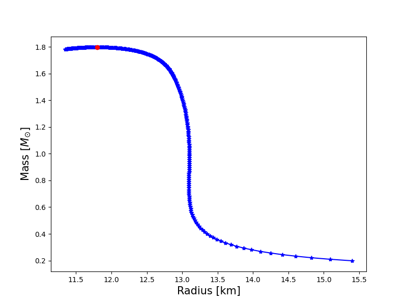
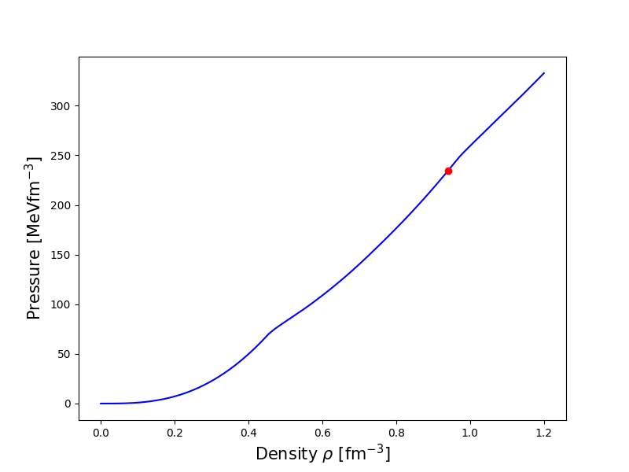
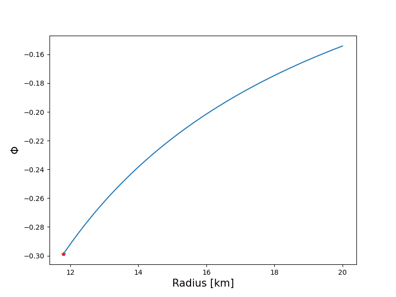

# PYTOV: Python Tolman-Oppenheimer-Volkoff equation solver


PYTOV is a simple Python implementation to integrate the Tolman-Oppenheimer-Volkoff (TOV) equations.


The program PYTOV integrates the following set of four equations ():
<p align="center"></p>
<p align="center"></p>
<p align="center"></p>
<p align="center"></p>
These equations include the TOV equations [1,2] supplemented with an equation for the total number of baryons in the compact star. The dependent variables are the gravitational mass, the gravitational potential, the pressure and the total number of baryons.

This repository contains:
- A data file (**bps.dat**) containing the low density equation of state known as BPS [3].
- A data file (**beta_eos.dat**) containing a high density equation of state obtained from a Hartree-Fock calculation of the Quark-Meson Coupling (QMC) model, specifically the *Standard* variation appearing in [5-7].

- The python script **PYTOV.py** which integrates the above mentioned equations. The following is a brief summary of what the code does:

    +   A high density equation of state file and a low density equation of state file will be read and then combined in a simple manner.

    +   Simple logarithmic interpolation of the combined equation of state is used [4].

    +   A simple fixed step fourth order Runge-Kutta method is used to integrate the TOV equations. A central density is specified and the TOV equations are integrated out to the surface of the compact star. This is repeated for a range of densities.

    -   The required data for a mass vs radius curve is output to a file (**compact_stars.dat**) along with a file containing the details of the maximum mass compact star (**max_mass_star.dat**). Running PYTOV will also produce the following figures:
    - a mass vs radius figure
      

    - pressure vs density figure
      

    - and a gravitational field vs radius figure
      

## Additional notes

Set up a virtual environment and install the prerequisites
```bash
python -m venv venv
source venv/bin/activate
pip install -U pip
pip install numpy matplotlib pyqt5
```

To run:
```bash
python PYTOV.py
```

PYTOV is a simple code to illustrate how one can solve the TOV equations. It comes with two sample equations of state (EoS), a low density equation of state known as the BPS EoS and a higher density EoS based on the Quark-Meson Coupling (QMC) model. If you intend to use this code with your own EoS, please make sure your EoS data file is in the same units as the ones provided and the columns are in the same order. These are as follows:

Density [fm^-3], Pressure [MeVfm^-3] and Energy Density [MeVfm^-3].

You should also check that your high density EoS has some overlap with the low density EoS, so they can be joined. You may also want to change the starting central density etcetera. 

## References

1. J. R. Oppenheimer and G. M. Volkoff, G. M., "On Massive Neutron Cores". [Physical Review. 55 (4): 374–381 (1939)](https://journals.aps.org/pr/abstract/10.1103/PhysRev.55.374)
   
2. R. C. Tolman, "Static Solutions of Einstein's Field Equations for Spheres of Fluid". [Physical Review. 55 (4): 364–373 (1939)](https://journals.aps.org/pr/abstract/10.1103/PhysRev.55.364).

3. G. Baym, C. Pethick and P. Sutherland, The ground state of matter at high densities: Equation of state and stellar models, [Astrophysical Journal, vol. 170, p.299 (1971)](http://adsbit.harvard.edu/cgi-bin/nph-iarticle_query?1971ApJ...170..299B&defaultprint=YES&filetype=.pdf)

4. W. D. Arnett and R. L. Bowers, A microscopic interpretation of neutron star structure, [Astrophysical Journal Supplement, vol. 33, p.415 (1977)](http://articles.adsabs.harvard.edu/cgi-bin/nph-iarticle_query?1977ApJS...33..415A&amp;data_type=PDF_HIGH&amp;whole_paper=YES&amp;type=PRINTER&amp;filetype=.pdf)

5. [D. L. Whittenbury, PhD thesis](https://inspirehep.net/record/1495499/files/02whole.pdf) Hadrons and Quarks in Dense Matter: From Nuclear Matter to Neutron Stars, University of Adelaide.

6. D. L. Whittenbury, J. D. Carroll, A. W. Thomas, K. Tsushima, and J. R. Stone, Quark-meson coupling model, nuclear matter constraints, and neutron star properties. [Phys. Rev. C 89, 065801 (2014)](https://journals.aps.org/prc/abstract/10.1103/PhysRevC.89.065801)

7.  D. L. Whittenbury, H. H. Matevosyan, and A. W. Thomas, Hybrid stars using the quark-meson coupling and proper-time Nambu–Jona-Lasinio models. [Phys. Rev. C 93, 035807 (2016)](https://journals.aps.org/prc/abstract/10.1103/PhysRevC.93.035807)

8. Norman K. Glendenning, Compact Stars: Nuclear Physics, Particle Physics and General Relativity, Springer, 2012.  
